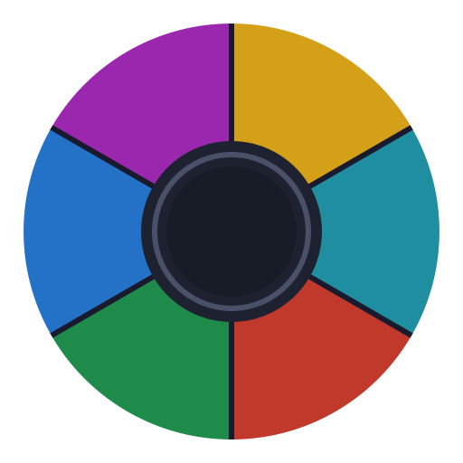
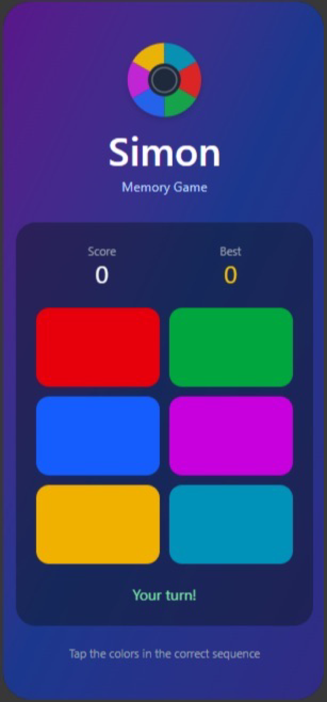
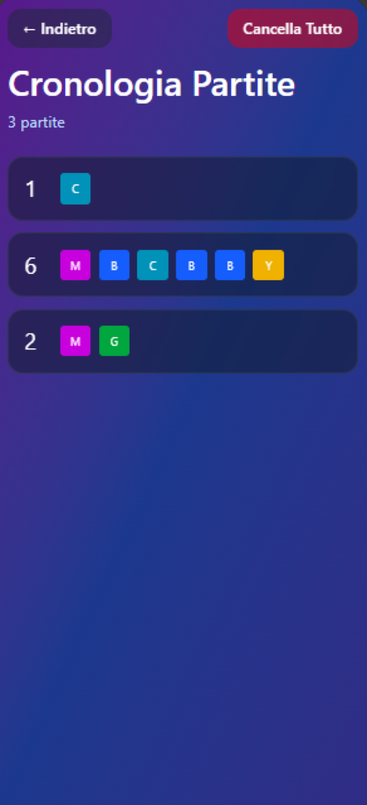

# Simon Game 🎮
A native Android implementation of the classic **Simon** memory game, built entirely with **Jetpack Compose**, as it is more intuitive, modern and versatile.  


---

## Development device
Tested on a **Samsung Galaxy A12 (SM-A127F/DSN)** running **Android 13**.

---

## Assets & UI
UI base and app logo designed with the help of **Figma AI**.  



---

## Project structure
```
com.example.simongame
├── MainActivity.kt       — navigation graph setup
├── StartScreen.kt        — main game screen
├── HistoryScreen.kt      — history of played games
└── GameConst.kt          — colors and game constants
```
